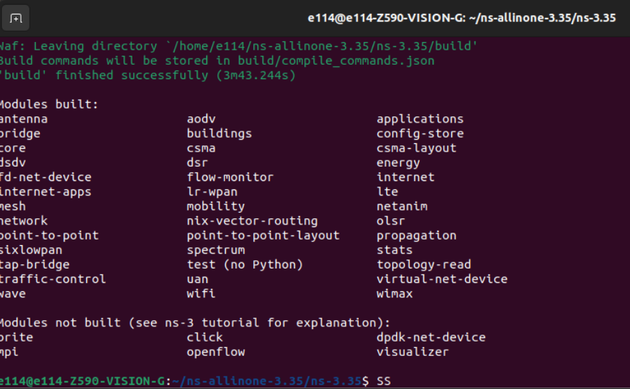

# Network Simulator 3 (NS-3) Installation for Ubuntu 20.04

- targets: Network Simulator 3 (NS-3) Installation and Implementation.
- version: NS-3.35

Introduction
---

- NS (Network Simulator) includes NS-1, NS-2, and NS-3. It is a series of discrete event network simulators, mainly used for research and education.
- NS-3 is an open-source research-oriented network simulation tool.

Installation of NS-3
---

1. Install dependencies

    ```bash=
    sudo apt install g++ python3 python3-dev pkg-config sqlite3 cmake
    ```

2. Download NS-3.35 and extract the file

    ```bash=
    cd && wget -c https://www.nsnam.org/releases/ns-allinone-3.35.tar.bz2
    tar -xvjf ns-allinone-3.35.tar.bz2
    ```

3. Use ./waf to build NS-3.35 installation

    ```bash=
    cd ns-allinone-3.35/ns-3.35/
    ./waf configure --enable-examples
    ./waf
    ```

4. Check the installation

    ```bash=
    ./waf --run hello-simulator
    ```
    
    If the installation is successful:
    

NS-3 NetAnim Installation
---

1. NetAnim installation

    ```bash=
    cd && cd ns-allinone-3.35/netanim-3.108
    make clean
    qmake NetAnim.pro
    make
    ```

2. Execute NetAnim

    ```bash=
    ./NetAnim
    ```

---

NS-3 Implementation
---